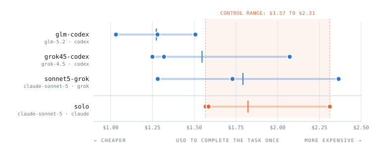

# S8: how much does a lane's cost vary between identical runs?

[s7-lane-cost.md](s7-lane-cost.md) ranked eleven lanes from one run each. This asks the
question that ranking cannot answer on its own: **are adjacent rows separable, or are
they ties?**

Three lanes from that table, three runs each, plus three runs of the no-orchestration
control, on the byte-identical S7 seed. 12 runs, 12 gate passes, $20.93, 1h25m.

## Answer

**Adjacent lanes are ties.** Every lane's cost range overlaps its neighbour's. Each lane
varies 1.46x to 1.85x against itself while adjacent lane means sit $0.24 to $0.27 apart,
so the run-to-run noise is roughly twice the difference being ranked.

**One comparison separates:** glm-codex (glm-5.2 on codex) came in cheaper than the
control (claude-sonnet-5 on claude) on all three runs, with no overlap.

<picture>
  <source media="(prefers-color-scheme: dark)" srcset="img/s8-cost-variance-dark.svg">
  
</picture>

Each dot is one run. The bar spans that lane's cheapest to priciest run; the vertical tick
is its mean. The shaded column is the control's own range, so a lane reaching into it costs,
on some runs, exactly what not orchestrating costs.

## Method

- **Task:** the S7 seed, unchanged. Build a small Formula 1 database in Python, in memory:
  12 tables (circuits, teams, engines, drivers, cars, staff, sponsors, sessions, tyre sets,
  laps, pit stops, incidents) with foreign keys between them, an exact error precedence, all
  shared logic in one `core.py`, every table module under 40 non-blank lines (machine-enforced,
  so twelve copy-pasted modules cannot pass), plus a test file per table with at least 6 tests.
  Roughly 25 files from scratch.
- **Acceptance:** `python3 gate.py` exits 0 and `python3 -m unittest discover` is green,
  re-run by the aggregator in each run's own work tree, never taken from a run's self-report.
- **Design:** 4 legs x 3 repeats = 12 runs, serial. Rounds interleaved (control, lane A,
  lane B, lane C, repeat) rather than blocked per lane, so drift over the sweep does not load
  onto whichever lane ran last. One experiment id per run, because ingest is not idempotent.
- **Held constant:** same seed, same task string, architect pinned to claude-sonnet-5 on the
  claude harness for every orchestrated leg, control pinned to claude-sonnet-5 on the claude
  harness. The implementing model-harness pair is the only variable.
- **Statistics:** exact two-sided permutation test over all C(6,3) = 20 splits. Not a t-test:
  three points cannot establish the normality one assumes.

## Results

| leg | model | harness | run | total $ | architect $ | lane $ | wall | gate |
|---|---|---|---|---|---|---|---|---|
| glm-codex | glm-5.2 | codex | 1 | 1.280187 | 0.862496 | 0.417692 | 7m15s | pass |
| glm-codex | glm-5.2 | codex | 2 | 1.031550 | 0.783959 | 0.247591 | 6m30s | pass |
| glm-codex | glm-5.2 | codex | 3 | 1.507030 | 1.037520 | 0.469510 | 8m31s | pass |
| grok45-codex | grok-4.5 | codex | 1 | 2.072216 | 1.351675 | 0.720542 | 8m29s | pass |
| grok45-codex | grok-4.5 | codex | 2 | 1.249946 | 0.877526 | 0.372420 | 5m36s | pass |
| grok45-codex | grok-4.5 | codex | 3 | 1.319077 | 0.930155 | 0.388922 | 5m27s | pass |
| sonnet5-grok | claude-sonnet-5 | grok | 1 | 1.729341 | 1.036502 | 0.692839 | 9m17s | pass |
| sonnet5-grok | claude-sonnet-5 | grok | 2 | 2.365285 | 1.659134 | 0.706151 | 11m53s | pass |
| sonnet5-grok | claude-sonnet-5 | grok | 3 | 1.281595 | 0.775266 | 0.506329 | 6m13s | pass |
| solo (control) | claude-sonnet-5 | claude | 1 | 2.312637 | n/a | n/a | 6m51s | pass |
| solo (control) | claude-sonnet-5 | claude | 2 | 1.586072 | n/a | n/a | 4m40s | pass |
| solo (control) | claude-sonnet-5 | claude | 3 | 1.568197 | n/a | n/a | 3m53s | pass |

### Variance

| leg | model | harness | n | mean | sd | CV | min | max | max/min |
|---|---|---|---|---|---|---|---|---|---|
| glm-codex | glm-5.2 | codex | 3 | 1.272923 | 0.237824 | 18.7% | 1.031550 | 1.507030 | 1.46x |
| grok45-codex | grok-4.5 | codex | 3 | 1.547080 | 0.456093 | 29.5% | 1.249946 | 2.072216 | 1.66x |
| sonnet5-grok | claude-sonnet-5 | grok | 3 | 1.792074 | 0.544562 | 30.4% | 1.281595 | 2.365285 | 1.85x |
| solo (control) | claude-sonnet-5 | claude | 3 | 1.822302 | 0.424737 | 23.3% | 1.568197 | 2.312637 | 1.47x |

### Separability

| comparison | model · harness | mean gap | ranges overlap | p | verdict |
|---|---|---|---|---|---|
| glm-codex vs grok45-codex | glm-5.2 · codex vs grok-4.5 · codex | +0.274157 | yes | 0.500 | tie |
| grok45-codex vs sonnet5-grok | grok-4.5 · codex vs claude-sonnet-5 · grok | +0.244994 | yes | 0.600 | tie |
| glm-codex vs solo | glm-5.2 · codex vs claude-sonnet-5 · claude | -0.549379 | **no** | 0.100 | **separated** |
| grok45-codex vs solo | grok-4.5 · codex vs claude-sonnet-5 · claude | -0.275222 | yes | 0.500 | tie |
| sonnet5-grok vs solo | claude-sonnet-5 · grok vs claude-sonnet-5 · claude | -0.030228 | yes | 1.000 | tie |

**The design floor is p = 0.10.** At n=3 per group the smallest achievable two-sided
permutation p is 2/20, so nothing here can reach p<0.05 regardless of how clean the
separation. Range overlap is the primary verdict; p = 0.100 means "as separated as three
runs can demonstrate".

## Findings

1. **Adjacent lanes are indistinguishable.** glm-codex $1.03 to $1.51, grok45-codex $1.25 to
   $2.07, sonnet5-grok $1.28 to $2.37. Those intervals sit on top of each other.

2. **Within-lane spread exceeds between-lane gaps**, by roughly 2x. A single measurement of a
   lane carries more noise than the quantity being ranked.

3. **Rank order is unstable run to run**, even though the three-run mean order reproduced S7's.
   Round 1 alone gave glm-codex < sonnet5-grok < grok45-codex, with the middle two swapped.

4. **The control spans $1.568197 to $2.312637.** S7 measured the same control once, at
   $1.129865, below that entire range. Any ratio computed against a single control draw
   inherits this spread.

5. **Lanes land at 0.699x to 0.983x of control mean here**, versus S7's finding that every
   lane cost more than the control. That direction is not robust to how the control is sampled.

6. **The control still wins wall clock:** 5m08s mean (3m53s to 6m51s) against 6m30s to 9m07s
   for the lanes. Orchestration's time cost is more consistent than its money cost.

7. **Architect cost is not a fixed toll.** The same architect ranged $0.775266 to $1.659134
   within three lanes, tracking total cost rather than sitting at a floor.

## Limits

- **n=3.** Powered to detect overlap and complete separation, not to rank finely, and it
  cannot reach p<0.05 by construction.
- **One task, one seed, one architect model, one machine.** The variance measured is variance
  on this task.
- **Findings 4 and 5 span two sessions**, so they mix sampling variance with drift between
  those dates. Read them as "S7's control is not reproducible today", not "S7 mismeasured".
  Findings 1, 2, 3, 6 and 7 are entirely within S8.
- **Proxy-routed lane costs remain imputed** from `config/prices.json`, not harness-reported.
- **Cost tracks turn count** (the control ran 45 turns at $2.31, 33 at $1.59, 31 at $1.57), so
  the variance is the model taking a different-length path each run, not a billing artifact.

## One measurement trap worth stealing

The first attempt produced a control run reading **3h01m of measured wall clock against a
self-reported 9m17s**, ending in `API Error: Connection closed mid-response`. The machine had
entered macOS Maintenance Sleep repeatedly with `TCPKeepAlive=inactive`, killing the harness's
API socket. `pmset` showed `PreventUserIdleSystemSleep 1` but `PreventSystemSleep 0`: an
idle-sleep assertion does not block maintenance sleep.

**The rule:** a run whose measured wall clock greatly exceeds its own reported duration was
interrupted by the machine. Treat it as an invalid sample and re-run it under a new experiment
id, rather than publishing it as a slow or failing lane. Without that check this run would have
been published as "the control is slow and fails the gate". Hold a system-sleep assertion
(`caffeinate -ims` on macOS) for the length of any sweep.

## What this means for reading S7

[s7-lane-cost.md](s7-lane-cost.md) presents a single-draw ranking of 11 lanes without error
bars. At this task size that ranking is not resolvable, and the control is the noisiest term
in every ratio it reports. Its two robust claims survive: harness choice moves cost as much as
model choice, and a cost is meaningless without a gate. Its ordering of neighbouring lanes, and
its "every lane cost more than solo" headline, should be read as one draw rather than a result.

## Reproduction

Single-lane sweeps use `--lane` with one experiment id per run, then join them:

```bash
# one run
scripts/ab-run --task "$TASK" --target ./seed \
  --experiment s8-glm-codex-r1 --skip-solo \
  --lane glm-codex --pitwall-model claude-sonnet-5 \
  --verify 'python3 gate.py && python3 -m unittest discover'

# join runs into one table
scripts/pitwall_compare.py \
  "control=s8-solo-r1=solo" \
  "glm-codex=s8-glm-codex-r1=lane"
```

Hold a sleep assertion around the whole sweep, run legs serially, and give every run its own
experiment id: ingest is not idempotent.
